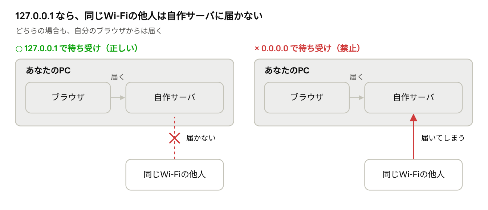

# 基礎編：まずここから

## はじめに

この基礎編は、プログラミングもWeb開発も初めての人が、本編を読むために必要な言葉を身につけるためのものです。コマンドを実行する必要はありません。読むだけで30〜40分ほどです。

正直に伝えておくと、元の研修（training-web-app）は「プログラミングの初歩から学ぶ教材ではない」と明記されています。合計96〜144時間の研修で、Ruby・ターミナル・Gitを使えることが前提です。この基礎編で言葉と全体像をつかみ、最後の節の順番で前提知識を埋めていくのがおすすめです。

わからない言葉が出てきたら、下の「用語集」を引いてください。

## Webの仕組み

Webページを見るとき、裏では「お願い」と「返事」のやり取りが起きています。レストランにたとえるとわかりやすくなります。

| 言葉 | レストランでたとえると | 実際には |
| --- | --- | --- |
| ブラウザ（クライアント） | 注文するお客さん | Chrome や Safari など。ページをくださいと頼む側 |
| サーバ | 厨房 | 頼まれたページを作って返すプログラム。この研修では自分で作る |
| HTTP | 注文票の書き方のルール | 「このページをください」「はいどうぞ」をやり取りする約束ごと |
| リクエスト ／ レスポンス | 注文 ／ 出てきた料理 | ブラウザからのお願い ／ サーバからの返事 |
| IPアドレス | お店の住所 | ネットワーク上でコンピュータを指す番号。例：`192.168.1.10` |
| ポート | お店の中の窓口番号 | 1台のPCの中で、どのプログラム宛てかを区別する番号。例：`3000` |
| 待ち受ける（listen） | 窓口を開けて客を待つ | サーバが「この住所と窓口番号で受け付けます」と準備すること |

ブラウザに `http://127.0.0.1:3000/` と入力すると、「`127.0.0.1` という住所の、3000番窓口に、HTTPでページを頼む」という意味になります。

**127.0.0.1（ループバック）は特別な住所です。** 意味は「自分自身のこのPC」で、`localhost` という名前でも呼ばれます。家の中の内線電話のようなもので、外からはかけられません。それに対して `0.0.0.0` で待ち受けると、「このPCのどの入口からでも受け付ける」という意味になります。内線だけでなく外線にも出る状態です。

本編のルール1で「127.0.0.1 で待ち受ける」と求めているのは、カフェなどで同じWi-Fiにいる他人から自作サーバに入られないようにするためです。

## ターミナル・Git・GitHub

**ターミナル**は、文字で命令を打ち込んでPCを操作する画面です。マウスでフォルダを開く代わりに、`cd work`（workフォルダに移動）のように書きます。本編のグレーの枠にある `lsof ...` や `git ...` は、すべてターミナルに打つ命令（コマンド）です。`#` から後ろは説明書き（コメント）で、実行されません。

**Git** は、ファイルの変更履歴を記録する道具です。ゲームのセーブデータのように、いつでも前の状態に戻れます。

| 言葉 | 意味 |
| --- | --- |
| リポジトリ | 履歴ごと保存されているフォルダ |
| コミット（commit） | セーブすること。一度セーブした内容は履歴にずっと残る |
| プッシュ（push） | 自分のPCのセーブデータを GitHub にアップすること |
| `.gitignore` | 「このファイルはセーブしない」と書いておくリスト |

**GitHub** は、Gitのリポジトリをインターネット上に置いて共有できるサービスです。公開（public）にすると世界中の誰でも見られます。

**ここが安全上のポイントです。** Gitは「全部のセーブ」を覚えています。秘密のファイルを一度コミットすると、あとで削除しても古いセーブには残ったままです。だから本編では、秘密のファイルを作る前に `.gitignore` に書いておくように求めています。

## HTTPS・証明書・秘密鍵

**HTTP** のやり取りは、ハガキのように途中で誰でも読めます。**HTTPS** は、それを鍵付きの箱に入れて送る仕組みです。本編の「TLS」は、この鍵付きの箱の技術の名前です。

| 言葉 | たとえ | 実際には |
| --- | --- | --- |
| 秘密鍵（`key.pem`） | 本物のお店だけが持つ合鍵 | サーバが本物だと証明するための秘密のファイル。**絶対に人に渡さない** |
| 証明書（`cert.pem`） | お店の身分証明書 | 公開してよい情報。この身分証と合鍵が対になっている |
| 自己署名証明書 | 自分で作った手作りの身分証 | 役所（認証局）のお墨付きがない。練習用には十分 |
| 証明書の検証 | 身分証を確かめること | 「この相手は本物か」を確認する |

秘密鍵が他人の手に渡ると、その人が本物のお店になりすませます。だから本編のルール3では、`key.pem` をコミットしないことを求めています。

`curl -k` は「身分証を確かめずに信用する」という命令です（`curl` はターミナルからページを取得する道具）。練習で比べるとき以外は使いません。本編のルール4は、このことを言っています。

## 4つの攻撃をたとえ話で

4つの攻撃はどれも、「入力された文字を信用しすぎた」か「誰からのお願いか確かめなかった」ことで起きます。図書館を舞台に説明します。

### パストラバーサル：立入禁止の書庫に入られる

司書さんに「一般の棚の、隣の棚の、さらに奥の…」と道順を伝え、立入禁止の書庫の本を持ってこさせる攻撃です。`../` は「1つ上のフォルダへ」という意味で、これを重ねて公開していないファイルを読み出します。

**対策**：たどり着いた場所が一般の棚の範囲内かを確認し、外なら断る。

### XSS：掲示板の貼り紙が「命令」になる

図書館の掲示板に、「これを読んだ人は、自分の利用者カードを箱に入れること」と書いた紙を貼るような攻撃です。Webでは、投稿欄にプログラム（`<script>`）を書き込み、それを見た他の人のブラウザで実行させます。

**対策**：投稿された文字は「ただの文字」として表示し、命令として扱わない（エスケープ）。

### CSRF：別人が書いた申請書に、知らないうちに署名させられる

悪い人が「全部の本を廃棄します」という申請書を用意し、司書さんに提出させる攻撃です。Webでは、あなたが別のサイトを開いただけで、そのサイトがあなたのブラウザから自作サーバへ「削除して」というお願いを送ります。ブラウザは自分のPCの中にあるので、`127.0.0.1` で待ち受けていても届いてしまいます。

**対策**：本物の申請書にだけ割印（トークン）を押しておき、割印のない申請は断る。

### SQLインジェクション：検索用紙に「命令」を書き足す

司書さんは、用紙に書かれたとおりに台帳を調べます。そこで書名欄に「山田、または全員」と書くと、全員分の貸出記録を渡してしまう、という攻撃です。SQLはデータベース（台帳）に命令するための言葉です。

**対策**：用紙の「書名欄」に書かれたものは、何があってもただの書名として扱う（バインド）。

## 用語集

| 用語 | ひとことで |
| --- | --- |
| `0.0.0.0` | 「このPCのすべての入口」。外からもつながる |
| `127.0.0.1` / `::1` / localhost | 「自分自身のこのPC」。外からはつながらない |
| CSRF | 他のサイトから、本人になりすましたお願いを送られる攻撃 |
| curl | ターミナルからWebページを取得する道具 |
| DB（データベース） | データを整理して保存する台帳。この研修では SQLite を使う |
| ERB | HTMLの中にRubyで値を埋め込む仕組み |
| HTML | Webページの見た目を書く言葉 |
| HTTP / HTTPS | ブラウザとサーバのやり取りのルール。S付きは暗号化されている |
| ORM | プログラムからDBを扱いやすくする仲介役 |
| Rack | Rubyでサーバとアプリをつなぐ共通の約束 |
| Rails | Rubyの代表的なWebアプリの部品セット（フレームワーク） |
| Ruby | この研修で使うプログラミング言語 |
| Socket（ソケット） | プログラム同士が通信するための受話器 |
| SQL / SQLインジェクション | DBへの命令の言葉 ／ 入力欄からその命令を書き換える攻撃 |
| TLS | HTTPSの暗号化を担う技術 |
| WEBrick | Ruby製の小さなWebサーバ。研修で中身を読む |
| XSS | 投稿に仕込んだプログラムを、他人のブラウザで動かす攻撃 |
| エスケープ | 特別な意味を持つ文字を、ただの文字に変えること |
| タイムアウト | 一定時間内に終わらなければ打ち切ること |
| テスト | プログラムが期待どおり動くかを自動で確かめるプログラム |
| トークン | 本人確認に使う合言葉のような文字列 |
| バインド | SQLに値を、命令と混ざらない形で渡すこと |
| パストラバーサル | `../` で公開範囲の外のファイルを読む攻撃 |
| フレームワーク | アプリを作るための部品と組み立て方のセット |
| 本番 | 実際の利用者が使う環境。この研修の成果物は本番に出せない |
| ループバック | 自分のPCの中だけで完結する通信 |

## 本家研修に進むまでの順番

元の研修のREADMEにある前提知識を、下の順に埋めていきます。各ステップの「できたら次へ」は、READMEの「対象読者と前提知識」をもとにしています。

1. **この基礎編と本編を読む**
    - できたら次へ：本編の確認クイズを、用語集を見ながら解ける
2. **ターミナルに慣れる**
    - できたら次へ：フォルダの移動・ファイル作成・コマンド実行・`Ctrl-C` での停止ができる
3. **Gitの基本を覚える**
    - できたら次へ：`clone`・`status`・`diff`・`add`・`commit` を使える
4. **Rubyの入門をやる**
    - できたら次へ：条件分岐・繰り返し・配列・Hash・メソッド・クラス・例外を使って、小さなスクリプトを自力で書ける
5. **HTMLを読めるようになる**（必須ではないが、Phase 4 以降が楽になる）
6. **本家研修の「最初に行うこと」へ進む**

AIを使うときは、本家研修のルールを先取りしておくと効果的です。「この用語をもっと簡単に説明して」「私の理解は合っている？」と聞くのはおすすめです。コードや答えを丸ごと作らせるのはやめましょう。

---

[次へ：本編 →](./02-main.md)
